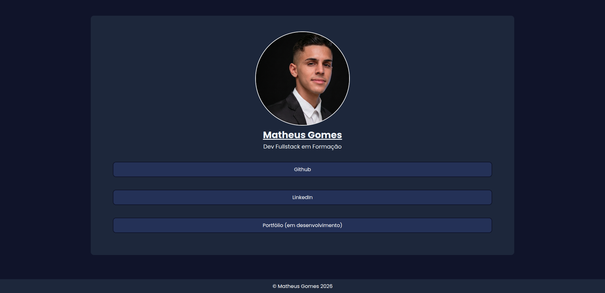

# 💻 Projeto: Linktree simples

### 🎯 Objetivo

Criar uma página tipo **perfil pessoal com links** (bem estilo Linktree), usando:

- Classes e IDs
- Cores e fontes
- Box model (padding, margin, border)
- Hover
- Centralização
- Listas + links

---

# 🧠 O que treinei

- `.class` vs `#id`
- `padding`, `margin`, `border`
- `box-sizing: border-box`
- `text-align: center`
- `:hover`
- `list-style: none`
- `width + margin: auto`
- `rem / px`

---

# 🖼️ Layout

